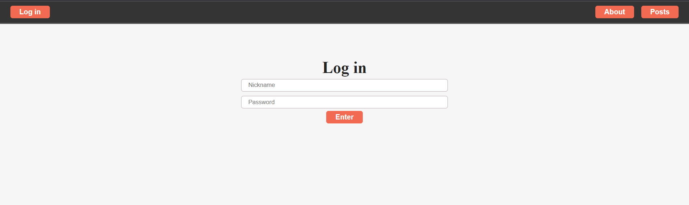
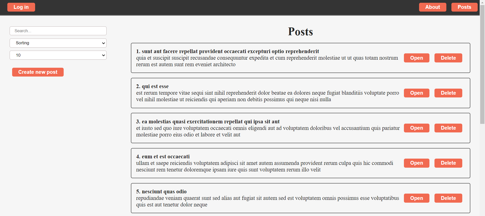

### Blog app (using React js)

## Link: https://jixlen999.github.io/react-studies-project/

Here you can see React app that I've done during studying. Development was done using API, axios, react routing, some react hooks (useState, useEffect, useRef), also some custom hooks were created.
### Note: Login page is not connected to any database so you don't need to enter any data, just click "Enter" to continue.

#### Some screenshots:

